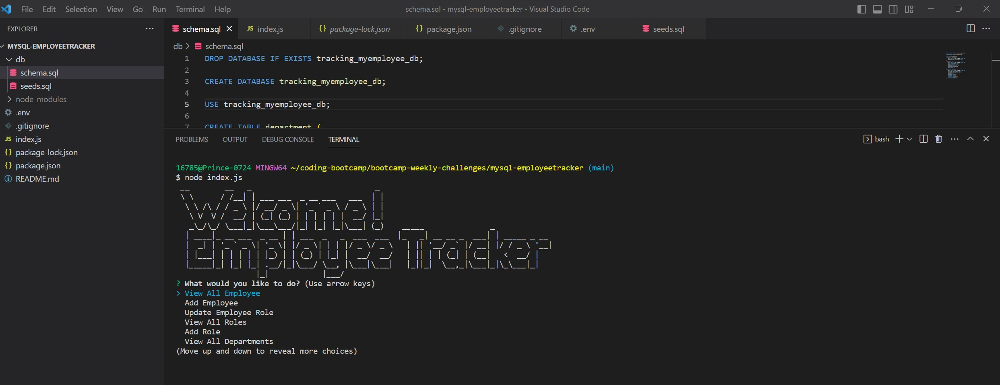

# mysql-employeetracker

## Description
Employee Tracker is a Node.js CLI application for managing a company's employee information including departments, roles, and employee details. It uses inquirer for user input and stores the information in a MySQL database. It allows for viewing, adding, and updating employees, roles, and departments.

## Table of Contents
- [Description](#Description)
- [Installation](#Installation)
- [Usage](#Usage)
- [Questions](#Questions)

## Installation
1. Clone this repository.

2. Run ‘npm install’ from the terminal at the root directory of the local repository to install the required packages.
```
npm install mysql2 console.table inquirer figlet dotenv
```

3. Create a .env file in the root of your project folder and add the following environment variables with the values for your database connection:
```
DB_USER=your_database_username
DB_PASSWORD=your_database_password
DB_NAME=your_database_name
```

4. Open up mysql enter info. In mysql run source schema and seed.sql and then exit
```
mysql -u root -p
source db/schema.sql
source db/seeds.sql
exit
```

5. Save the file and run the following code in command line:
```
node index.js
```
## Usage

### Video Walkthrough Link

https://clipchamp.com/watch/dcfBFRwqwF4

### Screenshot of Application Terminal




## Questions
  [Reggiejr44](https://github.com/Reggiejr44)  
  regprince788@gmail.com